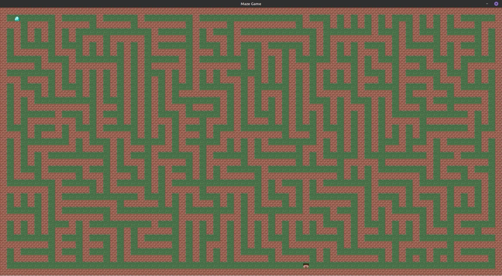

# Overview

This is an old simple project from university, containing maze game about Steve getting diamond.

## Information

This project was developed as a laboratory work for OOP course. It consisted of:

+ Studying `MVC` pattern;
+ Diving into Graphics with `Java Swing`;
+ Simple input-output system with `Listener` pattern;
+ A very simple algorithm of auto-generated maze (kind of :-) ).

## Conclusion

Using `Minecraft` textures is not intended to be copyright - this project is not commercial ~~wow, really~~.

If you want to try playing this ~~crappy~~ game by yourself, you can download `.jar` executable.